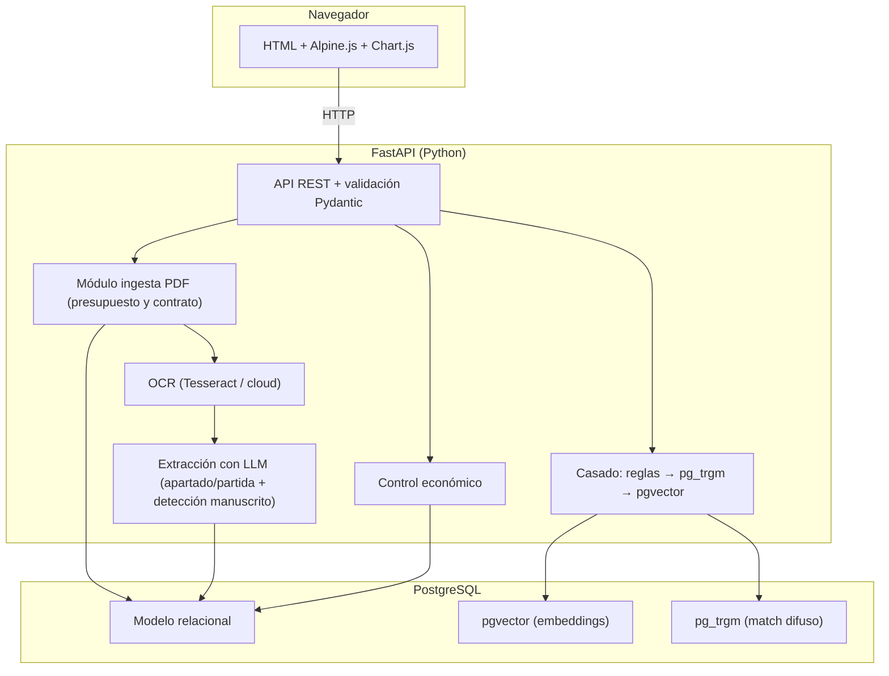
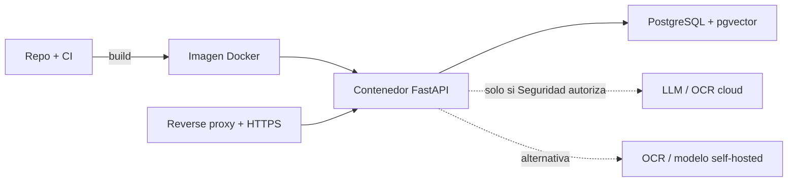
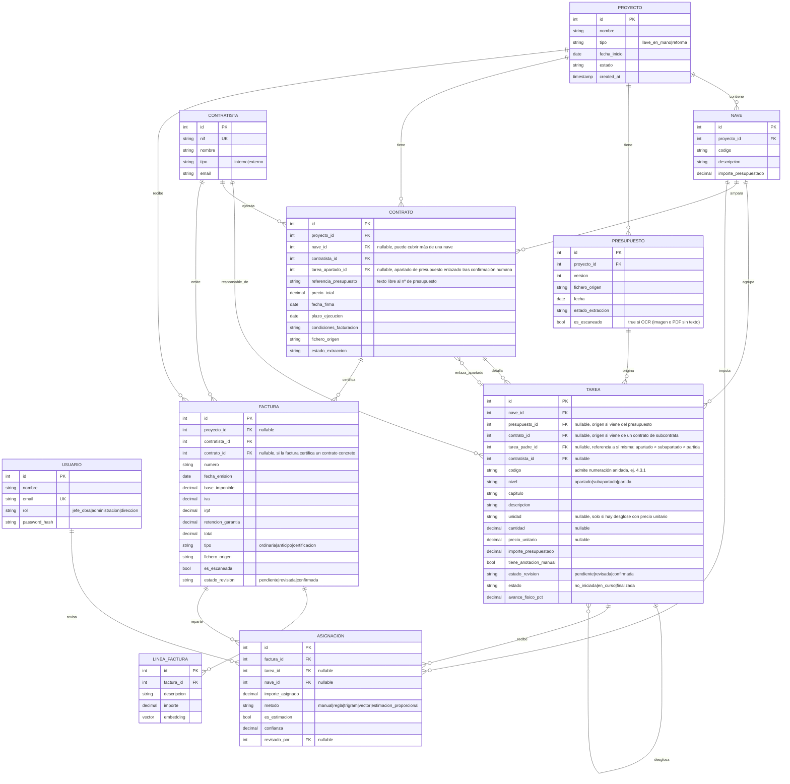

# Gestor de presupuestos y facturas de obra

*Versión 2 — 6 de septiembre de 2026. Actualiza el modelo de datos, historias, tickets y API a partir de un presupuesto y un contrato de subcontrata reales (anonimizados). Los cambios principales: partidas jerárquicas (apartado → subapartado → partida) en vez de tarea plana con precio unitario obligatorio, y una nueva entidad `CONTRATO`.*

## Índice

0. [Ficha del proyecto](#0-ficha-del-proyecto)
1. [Descripción general del producto](#1-descripción-general-del-producto)
2. [Arquitectura del sistema](#2-arquitectura-del-sistema)
3. [Modelo de datos](#3-modelo-de-datos)
4. [Especificación de la API](#4-especificación-de-la-api)
5. [Historias de usuario](#5-historias-de-usuario)
6. [Tickets de trabajo](#6-tickets-de-trabajo)
7. [Pull requests](#7-pull-requests)

---

## 0. Ficha del proyecto

### **0.1. Tu nombre completo:**

_[VERIFICAR] — Rellenar._

### **0.2. Nombre del proyecto:**

Gestor de presupuestos y facturas de obra _(nombre de trabajo; renómbralo si quieres uno comercial —[VERIFICAR])._

### **0.3. Descripción breve del proyecto:**

Aplicación interna para el seguimiento de proyectos de obra en explotaciones ganaderas (llave en mano y reformas). Lee presupuestos en PDF, extrae naves y partidas respetando su nivel real de detalle (apartado o, cuando existe, partida con precio unitario), lee también los contratos de ejecución firmados con subcontratistas, ingiere las facturas y compara el gasto real con lo presupuestado y con lo contratado. Separa siempre el control económico del avance físico de la obra.

### **0.4. URL del proyecto:**

_[VERIFICAR] — Aún sin desplegar. Rellenar cuando exista entorno._

### 0.5. URL o archivo comprimido del repositorio

_[VERIFICAR] — Rellenar con la URL del repo o el zip._

---

## 1. Descripción general del producto

### **1.1. Objetivo:**

Controlamos el gasto de obra con poco esfuerzo manual. Hoy el presupuesto va en PDF, a veces hay un contrato aparte con el subcontratista que ejecuta una partida, y las facturas llegan sueltas de cada proveedor; cruzar todo a mano es lento y poco fiable.

El producto resuelve cuatro cosas:

- **Ahorra trabajo de captura.** Lee el presupuesto en PDF y crea el proyecto con sus naves y partidas, sin teclear.
- **Respeta el nivel de detalle real.** Un presupuesto suele cerrar por apartado (un importe por sistema constructivo); un contrato de subcontrata puede bajar a partida con precio unitario. El sistema modela ambos niveles sin forzar uno inexistente.
- **Da control económico fiable.** Compara presupuestado, contratado y facturado, con el detalle que cada documento permita.
- **Separa dinero de ejecución.** Una partida puede estar pagada al 100% y sin terminar. El avance físico lo marca una persona; el gasto lo lleva el sistema.

Lo usan el jefe de obra, administración y dirección de Exafan.

### **1.2. Características y funcionalidades principales:**

- **Ingesta de presupuestos.** Sube PDF nativo, **PDF escaneado o imagen** (JPG/PNG/TIFF). El sistema extrae naves y partidas (apartado, código, descripción, importe y, cuando existan, unidad/cantidad/precio unitario) y crea el proyecto. Los escaneados pasan por OCR (`es_escaneado = true`). Detecta anotaciones manuscritas sobre el valor impreso y las marca para revisión obligatoria.
- **Ingesta de contratos de subcontrata.** Sube el contrato firmado con un subcontratista; el sistema extrae precio total, plazo, condiciones de facturación y, si existe, el desglose fino de partidas (por sala u otra unidad).
- **Ingesta de facturas.** Sube facturas o léelas de una carpeta compartida. Si vienen escaneadas, pasan por OCR.
- **Pantalla de revisión humana.** Cuando el OCR o el LLM dudan — o cuando hay una anotación manuscrita —, una persona confirma o corrige antes de guardar. No es opcional, ni siquiera con PDF nativo.
- **Enlace factura ↔ contratista.** Vínculo fiable y directo por NIF. Cuando hay un contrato de por medio, se propone también el enlace factura ↔ contrato.
- **Reparto estimado a nave/partida.** Cuando el contratista no desglosa, el sistema reparte proporcional al presupuesto y lo etiqueta siempre como estimación, nunca como dato medido.
- **Control económico.** Desvío presupuestado vs. contratado vs. facturado, por contratista, por contrato y por nave, con gráficos.
- **Seguimiento de estado.** No iniciada / en curso / finalizada, más porcentaje de avance físico, independiente del gasto.
- **Alertas.** Desvío sobre presupuesto, desvío sobre lo contratado (caso real: partida de electricidad), sobrecoste, partida sin facturas. _[VERIFICAR] set final de alertas con dirección._

### **1.3. Diseño y experiencia de usuario:**

Flujo previsto (detalle en `docs/flujo_ui_proyecto.md`):

1. El jefe de obra sube el presupuesto en PDF.
2. El sistema lo lee y muestra las naves y partidas detectadas para validar, respetando su nivel real (apartado o partida).
3. Se crea el proyecto; la pantalla del proyecto muestra la **lista de apartados**.
4. Dentro del proyecto se suben contratos de subcontrata; el sistema **sugiere** el apartado de presupuesto correspondiente y una persona confirma (`tarea_apartado_id`). Si el contrato aporta más detalle, se guarda como árbol propio sin mezclarlo con el del presupuesto.
5. Administración sube facturas o las lee de la carpeta compartida.
6. Si el OCR duda o hay una anotación manuscrita, la pantalla de revisión pide confirmar antes de guardar.
7. El sistema enlaza cada factura con su contratista (y su contrato, si aplica) y reparte el importe a nave/partida.
8. Dirección consulta el control económico: presupuestado vs. contratado vs. facturado, por contratista y por nave.

_[VERIFICAR] — Faltan capturas o vídeo del recorrido. Añadir cuando exista UI._

### **1.4. Instrucciones de instalación:**

_[VERIFICAR] — Comandos de referencia según el stack; ajustar al repo final._

Requisitos:

- Python 3.11+
- PostgreSQL 16 con extensiones `pgvector` y `pg_trgm`
- Para presupuestos escaneados: claves `OCR_API_*` o `LLM_API_*` en `.env` (autorización Seguridad). **No hace falta Tesseract en el sistema.**

Pasos:

1. Clona el repo y entra en la carpeta.
2. Crea el entorno: `python -m venv .venv && source .venv/bin/activate`.
3. Instala dependencias: `pip install -r requirements.txt`.
4. Copia `.env.example` a `.env` y rellena `DATABASE_URL` y las claves de LLM/OCR **solo si Seguridad autoriza el uso cloud** (ver sección 2.5).
5. Crea la base de datos y habilita extensiones: `CREATE EXTENSION IF NOT EXISTS vector; CREATE EXTENSION IF NOT EXISTS pg_trgm;`.
6. Aplica migraciones: `alembic upgrade head`.
7. Carga semillas (contratistas y usuarios de prueba, anonimizados): `python -m app.seed`.
8. Arranca: `uvicorn app.main:app --reload`.

El front se sirve desde FastAPI en `/`. No hay build ni proyecto de front aparte.

---

## 2. Arquitectura del Sistema

### **2.1. Diagrama de arquitectura:**



**Patrón.** Monolito modular servido por FastAPI: un solo despliegue, front ligero servido desde el propio backend, una única base de datos que hace lo relacional y lo vectorial.

**Por qué esta arquitectura.**

- El trabajo duro (leer PDF, OCR, extracción con LLM, embeddings) vive en Python, que tiene el ecosistema más maduro para esto.
- Los datos son relacionales de verdad: proyecto → naves → partidas jerárquicas → contratos → facturas → importes → estados exige integridad referencial y sumas que cuadren.
- Lo vectorial es un medio, no el fin: cabe en Postgres con `pgvector`. Un proyecto tiene decenas de partidas, no millones; no hace falta base vectorial dedicada.

**Beneficios.** Un solo lenguaje donde importa, un solo despliegue, menos infraestructura, arranque rápido del MVP.

**Sacrificios.** El monolito escala peor si el volumen o la parte de IA crecen mucho; en ese caso migraríamos a un microservicio de IA aislado (Opción C del stack). El front sin build limita interfaces muy complejas, aunque cubre de sobra la pantalla de revisión.

### **2.2. Descripción de componentes principales:**

- **Front — HTML + Alpine.js + Chart.js.** Reactividad con atributos en el HTML, sin bundler. Chart.js para gráficos de desvío. Tabulator opcional si las tablas de revisión crecen (especialmente para revisar jerarquías apartado → partida).
- **Backend — FastAPI (Python).** API tipada. Pydantic valida los datos extraídos casi gratis.
- **Librerías de documento — PyMuPDF / pdfplumber.** Lectura de PDF nativos (presupuestos y contratos), fiable en el texto impreso.
- **OCR — API cloud / visión LLM (por defecto).** Sin instalar Tesseract en el host. Claves `OCR_API_*` o `LLM_API_*`. Alternativa opcional: Tesseract si ya está. Baja fiabilidad, obliga a revisión humana.
- **Extracción — LLM vía API.** Convierte texto suelto de presupuesto, contrato o factura en campos estructurados; debe distinguir explícitamente valor impreso de valor manuscrito cuando ambos aparecen.
- **Casado — reglas + `pg_trgm` + `pgvector`.** Vectores para el "se parece", reglas para el "cuadra".
- **Base de datos — PostgreSQL.** Modelo relacional, embeddings (`pgvector`) y match difuso (`pg_trgm`) en la misma base.

### **2.3. Descripción de alto nivel del proyecto y estructura de ficheros**

_[VERIFICAR] — Estructura propuesta; ajustar al repo real._

```
app/
├── main.py            # Arranque FastAPI, sirve front y monta routers
├── config.py          # Variables de entorno y ajustes
├── db.py              # Conexión y sesión de Postgres
├── models/            # Modelos SQLAlchemy (proyecto, nave, tarea, contrato, factura...)
├── schemas/           # Esquemas Pydantic (validación entrada/salida)
├── routers/           # Endpoints por dominio (proyectos, contratos, facturas, control)
├── services/
│   ├── ingesta.py     # Lectura de PDF y orquestación de extracción
│   ├── ocr.py         # OCR de escaneados
│   ├── extraccion.py  # Llamadas al LLM y parseo a campos (detecta manuscrito vs impreso)
│   ├── casado.py      # Reglas + pg_trgm + pgvector
│   └── economico.py   # Cálculo de desvíos (presupuestado / contratado / facturado)
├── seed.py            # Semillas anonimizadas
└── static/            # HTML + Alpine.js + Chart.js
migrations/            # Migraciones Alembic
fixtures/              # presupuesto_nave_destete_anonimizado.md, contrato_subcontrata_electricidad_anonimizado.md
tests/                 # Tests unitarios e integración
```

Sigue una separación por capas: routers (entrada) → services (lógica) → models (datos). Facilita testear la lógica sin tocar la API.

### **2.4. Infraestructura y despliegue**

_[VERIFICAR] — Propuesta; sin desplegar todavía._



Despliegue previsto: `docker compose` con dos servicios (app y Postgres) tras un reverse proxy con HTTPS. Si Seguridad no autoriza cloud, se añade un servicio de OCR/modelo self-hosted. Secretos en variables de entorno, nunca en el repo ni en la URL.

### **2.5. Seguridad**

**[SENSIBLE]** — Los presupuestos, contratos y facturas llevan NIF, nombres, direcciones e importes pactados: son datos personales y financieros.

- **No sacar datos a terceros sin permiso.** Enviar estos documentos a OCR/LLM cloud es sacar datos personales fuera. Requiere autorización de **ai.seguridad@exafan.com** y cláusula contractual de que el proveedor **no entrena** con esos datos **[NO-ENTRENAR]**.
- **Alternativa si no se autoriza.** OCR/LLM self-hosted en contenedor propio. No depender de Tesseract instalado en cada puesto.
- **Validación en el backend, siempre.** La validación del front (no guardar hasta verificar) es comodidad, no seguridad. Se repite en el servidor con Pydantic.
- **Revisión humana obligatoria.** El OCR de escaneados fallará; una anotación manuscrita puede pasar desapercibida. Ningún documento se guarda sin confirmar cuando la extracción duda o detecta manuscrito sobre impreso.
- **Datos de prueba anonimizados.** No subir documentos reales sin anonimizar. Marcar dudosos con **[VERIFICAR]**. Usar `fixtures/presupuesto_nave_destete_anonimizado.md` y `fixtures/contrato_subcontrata_electricidad_anonimizado.md` como material de referencia y de test.
- **Control de acceso por rol.** Jefe de obra, administración y dirección con permisos distintos. Contraseñas con hash (argon2/bcrypt), HTTPS obligatorio.

### **2.6. Tests**

_[VERIFICAR] — Batería prevista; marcar como hecho lo que se implemente._

- **Extracción de presupuesto.** Con `presupuesto_nave_destete_anonimizado.md` como fixture: el número de naves y apartados detectados y la suma de importes cuadran con el total del documento; la corrección manuscrita del descuento final se detecta y fuerza revisión.
- **Extracción de contrato.** Con `contrato_subcontrata_electricidad_anonimizado.md`: se detecta el desglose por Sala con precio unitario y se enlaza correctamente como hijo de la partida de electricidad del presupuesto.
- **Control económico.** Presupuestado vs. contratado vs. facturado por contratista y por nave; las sumas cierran. Caso de prueba: el desvío real entre electricidad presupuestada y contratada.
- **Casado por contratista.** Enlace por NIF: la factura cae en el contratista correcto.
- **Reparto estimado.** El importe repartido a naves/partidas suma el total de la factura y va marcado como estimación.
- **Validación backend.** Pydantic rechaza payloads mal formados aunque el front los deje pasar.
- **Integración de ingesta.** Endpoint de subida con PDF de prueba: crea proyecto, naves y partidas con el nivel de jerarquía correcto.

---

## 3. Modelo de Datos

### **3.1. Diagrama del modelo de datos:**



### **3.2. Descripción de entidades principales:**

- **USUARIO.** Quien usa la app. `rol` define permisos (jefe de obra, administración, dirección). `email` único, contraseña con hash.
- **PROYECTO.** Una obra. Cabecera de todo. `tipo` distingue llave en mano de reforma.
- **PRESUPUESTO.** El fichero de origen (PDF nativo, PDF escaneado o imagen) y su versión. `es_escaneado` marca baja fiabilidad por OCR. Permite gestionar revisiones sin perder el histórico (los presupuestos reales llevan sufijo de versión, ej. "V2"). Enlaza con el proyecto.
- **NAVE.** Unidad de desglose del presupuesto. Guarda su importe presupuestado.
- **CONTRATISTA.** Equipo interno o subcontrata externa. `nif` único: es la clave del enlace fiable con las facturas.
- **CONTRATO.** El acuerdo de ejecución firmado con un subcontratista: precio cerrado, plazo y condiciones de medición/facturación. Distinto de `PRESUPUESTO` (lo que se ofertó al cliente) y de `FACTURA` (lo que se cobra mes a mes). Puede aportar un desglose de `TAREA` más fino del que trae el presupuesto — en el ejemplo visto, por Sala con precio unitario. `referencia_presupuesto` es texto libre al nº de presupuesto. `tarea_apartado_id` enlaza el contrato con el apartado de presupuesto correspondiente tras sugerencia automática y **confirmación humana** (ver `docs/flujo_ui_proyecto.md`).
- **TAREA.** Partida del presupuesto o del contrato, colgada de una nave. **Es jerárquica** (`tarea_padre_id`): un presupuesto suele generar filas de `nivel = "apartado"` con `importe_presupuestado` pero sin `unidad`/`cantidad`/`precio_unitario`; un contrato puede generar filas hijas de `nivel = "partida"` con esos campos rellenos. `presupuesto_id` y `contrato_id` (ambos nullable) registran de qué documento vino cada fila, para poder citar la fuente de cualquier cifra. `tiene_anotacion_manual` marca cuándo el valor impreso fue corregido a mano — fuerza `estado_revision = "pendiente"` sin excepción. `estado` (económico/administrativo) y `avance_fisico_pct` (ejecución real) van separados a propósito: pagado no es ejecutado.
- **FACTURA.** Documento del contratista. Siempre enlaza con un contratista (por NIF) y, cuando existe, con el `CONTRATO` que certifica — esto permite comparar contratado vs. facturado con precisión, no solo por contratista en bloque. Guarda base, IVA, IRPF, retención de garantía y `tipo` (ordinaria, anticipo, certificación). `estado_revision` controla la revisión humana; `es_escaneada` avisa de baja fiabilidad.
- **LINEA_FACTURA.** Detalle de la factura, si lo hay. `embedding` alimenta el casado semántico con `pgvector`.
- **ASIGNACION.** Tabla puente del casado. Reparte el importe de una factura a nave o tarea/partida. `es_estimacion` marca cuándo el reparto es proporcional al presupuesto (no medido). `metodo` y `confianza` registran cómo se hizo el enlace y `revisado_por` quién lo confirmó.

> **Nota de negocio [VERIFICAR].** Un presupuesto a cliente cierra habitualmente por apartado, sin precio unitario visible; un contrato de subcontrata sí puede bajar a partida con precio unitario. No sabemos aún si esto es la norma o un caso particular — hace falta un segundo presupuesto de referencia para confirmarlo. El reparto a partida cuando no hay desglose sigue siendo estimación proporcional al presupuesto, etiquetada como tal (ver `desglose_factura_direccion.docx`, pendiente de validación por Dirección).

---

## 4. Especificación de la API

_Cuatro endpoints principales en formato OpenAPI (resumido). Se añade la ingesta de contratos respecto a la versión anterior._

```yaml
openapi: 3.0.3
info:
  title: Gestor de presupuestos y facturas de obra
  version: 0.2.0
paths:
  /proyectos/importar-presupuesto:
    post:
      summary: Sube un presupuesto (PDF nativo, escaneado o imagen) y crea el proyecto con sus naves y partidas
      requestBody:
        required: true
        content:
          multipart/form-data:
            schema:
              type: object
              properties:
                fichero:
                  type: string
                  format: binary
                  description: PDF, JPG, PNG, TIFF o fixture .md
      responses:
        "201":
          description: Proyecto creado con naves y partidas extraídas (pendientes de validar)
          content:
            application/json:
              schema:
                type: object
                properties:
                  proyecto_id: { type: integer }
                  naves_detectadas: { type: integer }
                  partidas_detectadas: { type: integer }
                  requiere_revision: { type: boolean }
                  anotaciones_manuscritas_detectadas: { type: integer }
                  es_escaneado: { type: boolean }

  /proyectos/{id}/importar-contrato:
    post:
      summary: Sube un contrato de subcontrata y lo enlaza al proyecto (y, si aporta desglose fino, a sus partidas)
      parameters:
        - name: id
          in: path
          required: true
          schema: { type: integer }
      requestBody:
        required: true
        content:
          multipart/form-data:
            schema:
              type: object
              properties:
                fichero:
                  type: string
                  format: binary
                nave_id:
                  type: integer
                  nullable: true
      responses:
        "201":
          description: Contrato registrado, con las partidas de detalle que haya podido extraer
          content:
            application/json:
              schema:
                type: object
                properties:
                  contrato_id: { type: integer }
                  contratista_nif: { type: string }
                  precio_total: { type: number }
                  partidas_detalle_detectadas: { type: integer }
                  requiere_revision: { type: boolean }
                  sugerencias_apartado:
                    type: array
                    items:
                      type: object
                      properties:
                        tarea_id: { type: integer }
                        codigo: { type: string }
                        descripcion: { type: string }
                        confianza: { type: number }
                        motivo: { type: string }

  /proyectos/{id}/contratos/{contrato_id}/enlazar-apartado:
    post:
      summary: Confirma o corrige el enlace contrato ↔ apartado de presupuesto
      parameters:
        - name: id
          in: path
          required: true
          schema: { type: integer }
        - name: contrato_id
          in: path
          required: true
          schema: { type: integer }
      requestBody:
        required: true
        content:
          application/json:
            schema:
              type: object
              required: [tarea_apartado_id]
              properties:
                tarea_apartado_id: { type: integer }
      responses:
        "200":
          description: Enlace confirmado (tarea_apartado_id persistido)
          content:
            application/json:
              schema:
                type: object
                properties:
                  contrato_id: { type: integer }
                  tarea_apartado_id: { type: integer }
                  codigo_apartado: { type: string }
                  descripcion_apartado: { type: string }

  /facturas:
    post:
      summary: Sube una factura; aplica OCR si es escaneada y propone el casado
      requestBody:
        required: true
        content:
          multipart/form-data:
            schema:
              type: object
              properties:
                fichero:
                  type: string
                  format: binary
                proyecto_id:
                  type: integer
      responses:
        "201":
          description: Factura registrada siempre pendiente de revisión humana
          content:
            application/json:
              schema:
                type: object
                properties:
                  factura_id: { type: integer }
                  contratista_nif: { type: string }
                  contrato_id: { type: integer, nullable: true }
                  estado_revision: { type: string }
                  requiere_revision: { type: boolean }

    get:
      summary: Lista las facturas de un proyecto, con su contrato y revisión
      parameters:
        - name: proyecto_id
          in: query
          required: true
          schema: { type: integer }

  /facturas/{id}:
    get:
      summary: Devuelve los datos extraídos y contratos candidatos para revisión

  /facturas/{id}/confirmar:
    post:
      summary: Confirma o corrige la factura y su contrato asociado
      description: Solo después de esta confirmación la factura entra en el control económico.

  /proyectos/{id}/control-economico:
    get:
      summary: Desvío presupuestado vs. contratado vs. facturado, por contratista, por contrato y por nave
      parameters:
        - name: id
          in: path
          required: true
          schema: { type: integer }
      responses:
        "200":
          description: Resumen económico
          content:
            application/json:
              schema:
                type: object
                properties:
                  por_contratista:
                    type: array
                    items:
                      type: object
                      properties:
                        nif: { type: string }
                        presupuestado: { type: number }
                        facturado: { type: number }
                        desvio: { type: number }
                  por_contrato:
                    type: array
                    items:
                      type: object
                      properties:
                        contrato_id: { type: integer }
                        contratista_nif: { type: string }
                        contratado: { type: number }
                        facturado: { type: number }
                        desvio: { type: number }
                  por_nave:
                    type: array
                    items:
                      type: object
                      properties:
                        nave: { type: string }
                        presupuestado: { type: number }
                        gasto_estimado: { type: number }
                        es_estimacion: { type: boolean }
```

**Ejemplo — respuesta de `GET /proyectos/12/control-economico`:**

```json
{
  "por_contratista": [
    { "nif": "B00000000", "presupuestado": 120000, "facturado": 98000, "desvio": -22000 }
  ],
  "por_contrato": [
    { "contrato_id": 7, "contratista_nif": "B00000001", "contratado": 45000, "facturado": 30000, "desvio": -15000 }
  ],
  "por_nave": [
    { "nave": "Nave 1", "presupuestado": 60000, "gasto_estimado": 49000, "es_estimacion": true }
  ]
}
```

> El desvío por contratista y por contrato es dato medido (cuando hay contrato de por medio, es el más preciso: contratado vs. facturado). El desvío por nave es estimación mientras no haya certificación medida por nave (`es_estimacion: true`).

---

## 5. Historias de Usuario

**Historia de Usuario 1 — Ingesta de presupuesto**

Como **jefe de obra**, quiero **subir el presupuesto (PDF nativo, escaneado o imagen) y que el sistema cree el proyecto con sus naves y partidas, respetando si cierran por apartado o bajan a precio unitario**, para **no teclear cada partida a mano ni forzar un detalle que el documento no tiene**.

Criterios de aceptación:
- Subo un PDF nativo, un PDF escaneado o una imagen y veo las naves y partidas detectadas antes de confirmar, con su nivel real (apartado o partida).
- Si el origen es escaneado/imagen, el sistema lo marca (`es_escaneado`) y fuerza revisión humana.
- La suma de importes cuadra con el total del presupuesto; si no, me avisa.
- Si hay una anotación manuscrita sobre un valor impreso, el sistema me la señala explícitamente y no me deja guardar sin confirmarla.
- Puedo corregir un campo antes de confirmar la creación del proyecto.

**Historia de Usuario 2 — Ingesta de contrato de subcontrata**

Como **jefe de obra**, quiero **subir el contrato firmado con un subcontratista y que el sistema registre el precio cerrado, el plazo y, si lo hay, el desglose de partidas**, para **poder comparar después lo contratado con lo facturado, no solo lo presupuestado**.

Criterios de aceptación:
- Subo el contrato y veo el contratista, precio total y plazo detectados.
- Si el contrato desglosa por partidas con precio unitario, las veo listadas y puedo enlazarlas a la partida de presupuesto correspondiente.
- El sistema **sugiere** el apartado de presupuesto (p. ej. electricidad) y no asume el enlace: lo confirma una persona (`tarea_apartado_id`).
- El sistema no asume que el desglose del contrato sea el mismo que el del presupuesto: los muestra por separado hasta que confirmo el enlace.

**Historia de Usuario 3 — Revisión de factura con OCR**

Como **administrativo**, quiero **revisar lo que el sistema ha leído de una factura antes de guardarla**, para **corregir los errores del OCR y no meter datos mal**.

Criterios de aceptación:
- Al subir una factura escaneada, el sistema marca los campos con baja confianza.
- Veo el enlace propuesto factura ↔ contratista (y ↔ contrato, si existe) por NIF y puedo corregirlo.
- No se guarda nada hasta que confirmo.
- El backend vuelve a validar los datos aunque yo los haya confirmado en el front.

**Historia de Usuario 4 — Control económico para dirección**

Como **dirección**, quiero **ver el desvío entre presupuesto, contrato y gasto real por contratista y por nave**, para **gestionar la obra con datos y no de oído**.

Criterios de aceptación:
- Veo un gráfico de presupuestado vs. contratado vs. facturado por contratista.
- Cuando hay contrato, veo el desvío contratado-vs-facturado como dato medido, no estimado.
- El detalle por nave aparece claramente marcado como estimación cuando no hay certificación medida.
- Puedo filtrar por proyecto.
- Distingo el gasto (económico) del avance físico de cada partida.

---

## 6. Tickets de Trabajo

**Ticket 1 — Backend: ingesta de presupuesto (PDF nativo, escaneado o imagen)**

- **Descripción.** Implementar `POST /proyectos/importar-presupuesto`: leer PDF nativo con PyMuPDF/pdfplumber; si es imagen o PDF sin texto, pasar por OCR; extraer naves y partidas con el LLM respetando la jerarquía real; marcar `es_escaneado`; detectar anotaciones manuscritas; validar con Pydantic y persistir el proyecto en estado "pendiente de revisión".
- **Tareas.** Router y esquema; servicio de lectura + OCR; prompt de extracción; mapeo a modelos (`tarea_padre_id`); control de que las sumas cuadran.
- **Criterios de aceptación.** Con `fixtures/presupuesto_nave_destete_anonimizado.md`, crea proyecto con el nº correcto de naves y apartados; detecta la corrección manuscrita del descuento final y del color de cubierta; la suma de importes cuadra; devuelve `requiere_revision`. Un origen escaneado marca `es_escaneado=true` y fuerza revisión.
- **Definición de hecho.** Test de integración verde; validación Pydantic; sin datos reales en el repo.

**Ticket 2 — Backend: ingesta de contrato de subcontrata**

- **Descripción.** Implementar `POST /proyectos/{id}/importar-contrato`: leer el PDF del contrato, extraer contratista, precio total, plazo, condiciones de facturación y, si existe, el desglose de partidas (por sala u otra unidad) con precio unitario.
- **Tareas.** Router y esquema; extracción de cabecera del contrato (partes, CIF, objeto); extracción del desglose de partidas cuando exista, con su numeración anidada; enlace opcional a la partida de presupuesto correspondiente.
- **Criterios de aceptación.** Con `fixtures/contrato_subcontrata_electricidad_anonimizado.md`, detecta el contratista, el precio total y el desglose por Sala 1/2/3 con sus partidas.
- **Definición de hecho.** Test de integración verde con la fixture; validación Pydantic; sin datos reales en el repo.

**Ticket 3 — Frontend: pantalla de revisión humana**

- **Descripción.** Pantalla en HTML + Alpine.js para revisar lo extraído de un presupuesto, contrato o factura antes de guardar. Resalta campos de baja confianza y anotaciones manuscritas, y permite editar.
- **Tareas.** Vista con tabla editable y jerárquica (Tabulator si hace falta); marca visual de confianza baja y de "valor manuscrito detectado"; botón de confirmar que llama al backend; estado reactivo con Alpine.
- **Criterios de aceptación.** No permite guardar con campos obligatorios vacíos ni con una anotación manuscrita sin confirmar; muestra el enlace propuesto por NIF; al confirmar, envía al backend y refleja el resultado.
- **Definición de hecho.** Se sirve desde FastAPI; probada con las dos fixtures; recuerda que la validación real está en el backend.

**Ticket 4 — Base de datos: esquema y control económico**

- **Descripción.** Migraciones del modelo relacional (proyecto, nave, contratista, contrato, tarea jerárquica, factura, línea, asignación) y habilitar `pgvector` y `pg_trgm`.
- **Tareas.** Migraciones Alembic; extensiones; índices por NIF, por proyecto y por `tarea_padre_id`; columna `embedding` en línea de factura; semillas anonimizadas.
- **Criterios de aceptación.** `alembic upgrade head` crea todo; extensiones activas; consulta de desvío por contratista, por contrato y por nave devuelve datos coherentes con las semillas.
- **Definición de hecho.** Integridad referencial probada; el reparto estimado suma el total de la factura; documentado en el readme.

**Ticket 5 — Backend y frontend: ingesta y seguimiento de facturas**

- **Descripción.** Implementar la carga de facturas nativas o escaneadas, el casado exacto por NIF, la propuesta de contrato y la revisión humana antes de incorporarlas al control económico.
- **Tareas.** Endpoints `POST/GET /facturas`; extracción y OCR; validación Pydantic; pantalla de revisión; seguimiento contratado vs. facturado por apartado.
- **Criterios de aceptación.** Una factura pendiente no altera importes; solo se proponen contratos confirmados del mismo proyecto y contratista; al confirmar, se actualizan el apartado y el control por contrato.
- **Definición de hecho.** Pruebas con fixture ficticia anonimizada; validación de contratos ajenos; pantalla principal enlazada con proyecto, facturas y control.

---

## 7. Pull Requests

_[VERIFICAR] — Sustituir estas descripciones por enlaces a las PR reales cuando el repositorio remoto esté definido._

**Pull Request 1 — Ingesta de presupuestos (base del MVP)**

Añade la lectura de PDF nativo, la extracción jerárquica (apartado/partida) con LLM, la detección de anotaciones manuscritas y la creación de proyecto con naves y partidas. Incluye validación Pydantic y test de integración con la fixture de presupuesto anonimizada. Es el primer bloque del orden de trabajo: validar la ingesta antes de seguir.

**Pull Request 2 — Modelo de datos y control económico**

Migraciones del esquema relacional (incluye la nueva entidad `CONTRATO` y la jerarquía de `TAREA`), extensiones `pgvector` y `pg_trgm`, y el cálculo de desvío por contratista, por contrato y por nave. Marca el reparto a nave/partida como estimación mientras no haya certificación medida.

**Pull Request 3 — Ingesta de contratos de subcontrata**

Endpoint de subida de contratos, extracción de cabecera y de desglose fino cuando exista, y enlace opcional a la partida de presupuesto correspondiente. Incluye test de integración con la fixture de contrato anonimizada.

**Pull Request 4 — Ingesta de facturas, OCR y revisión humana**

Endpoint de subida de facturas, OCR de escaneados, enlace factura ↔ contratista (y ↔ contrato, si aplica) por NIF, y la pantalla de revisión humana ampliada a presupuestos y contratos con anotaciones manuscritas. Incluye la validación en backend y el aviso de baja confianza. El casado a partida (reglas → `pg_trgm` → `pgvector`) queda para una PR posterior.
