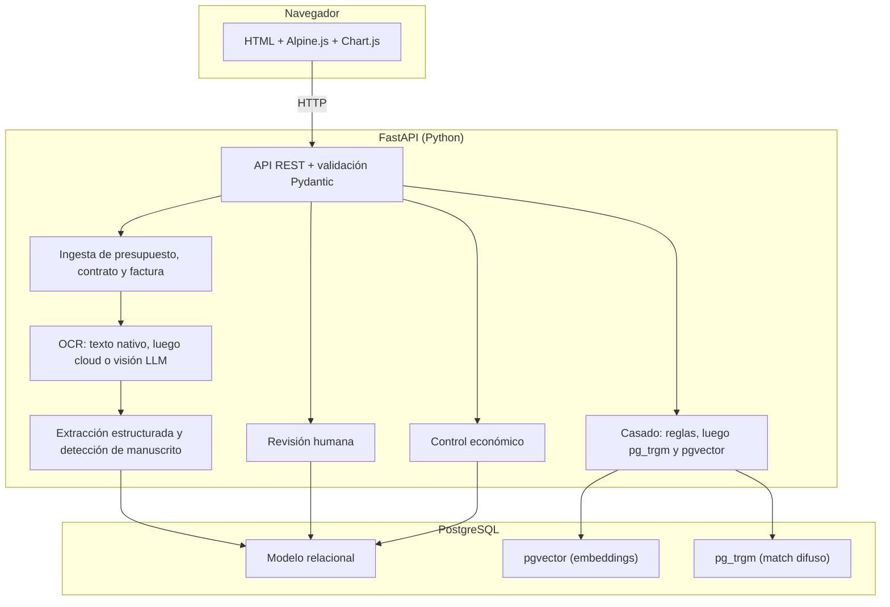
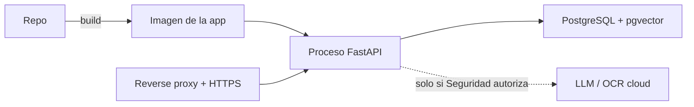
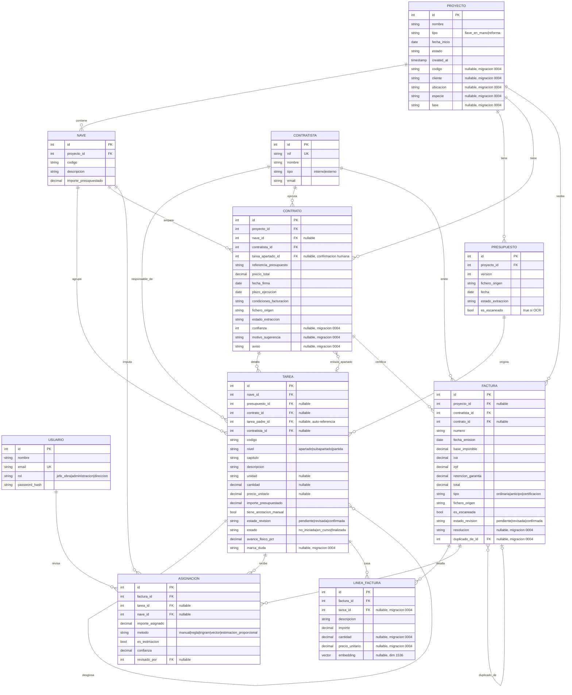

## Índice

0. [Ficha del proyecto](#0-ficha-del-proyecto)
1. [Descripción general del producto](#1-descripción-general-del-producto)
2. [Arquitectura del sistema](#2-arquitectura-del-sistema)
3. [Modelo de datos](#3-modelo-de-datos)
4. [Especificación de la API](#4-especificación-de-la-api)
5. [Historias de usuario](#5-historias-de-usuario)
6. [Tickets de trabajo](#6-tickets-de-trabajo)
7. [Pull requests](#7-pull-requests)

---

## 0. Ficha del proyecto

### **0.1. Tu nombre completo:**

_[VERIFICAR] — Rellenar el nombre completo. El repositorio está a nombre del usuario de GitHub `ffabian-exafan`._

### **0.2. Nombre del proyecto:**

Gestor de presupuestos y facturas de obra

### **0.3. Descripción breve del proyecto:**

Aplicación interna de Exafan para el seguimiento de obras en explotaciones ganaderas (llave en mano y reformas). Lee presupuestos en PDF, extrae naves y partidas respetando su nivel real (apartado o, cuando existe, partida con precio unitario), lee los contratos de ejecución firmados con subcontratistas, ingiere las facturas y compara el gasto real con lo presupuestado y con lo contratado. Separa siempre el control económico del avance físico de la obra.

### **0.4. URL del proyecto:**

_[VERIFICAR] — Aún sin desplegar._ En local, con la aplicación arrancada: [http://127.0.0.1:8000/](http://127.0.0.1:8000/). Documentación OpenAPI generada por FastAPI: [http://127.0.0.1:8000/docs](http://127.0.0.1:8000/docs).

### 0.5. URL o archivo comprimido del repositorio

[https://github.com/ffabian-exafan/AI4Devs-finalproject](https://github.com/ffabian-exafan/AI4Devs-finalproject) — rama `feature-entrega2-FFA`.

---

## 1. Descripción general del producto

### **1.1. Objetivo:**

Controlar el gasto de obra con poco trabajo manual. Hoy el presupuesto va en PDF, a veces hay un contrato aparte con el subcontratista que ejecuta una partida, y las facturas llegan sueltas de cada proveedor. Cruzar todo a mano es lento y poco fiable.

El producto resuelve cuatro cosas:

- **Ahorra trabajo de captura.** Lee el presupuesto en PDF y crea el proyecto con sus naves y partidas, sin teclear.
- **Respeta el nivel de detalle real.** Un presupuesto suele cerrar por apartado (un importe por sistema constructivo). Un contrato de subcontrata puede bajar a partida con precio unitario. El sistema modela ambos niveles sin forzar uno inexistente.
- **Da control económico fiable.** Compara presupuestado, contratado y facturado, con el detalle que cada documento permita.
- **Separa dinero de ejecución.** Una partida puede estar pagada al 100 % y sin terminar. El avance físico lo marca una persona; el gasto lo lleva el sistema.

Lo usan el jefe de obra, administración y dirección de Exafan.

### **1.2. Características y funcionalidades principales:**

- **Ingesta de presupuestos.** Sube PDF nativo, PDF escaneado o imagen (JPG/PNG/TIFF). El sistema extrae naves y partidas (apartado, código, descripción, importe y, cuando existan, unidad, cantidad y precio unitario) y crea el proyecto. Los escaneados pasan por OCR y quedan con `es_escaneado = true`. Detecta anotaciones manuscritas sobre el valor impreso y las marca para revisión obligatoria (`tiene_anotacion_manual = true`).
- **Ingesta de contratos de subcontrata.** Sube el contrato firmado con un subcontratista. El sistema extrae precio total, plazo, condiciones de facturación y, si existe, el desglose fino de partidas. Sugiere el apartado de presupuesto correspondiente; una persona confirma el enlace (`tarea_apartado_id`). El árbol del contrato no se mezcla con el del presupuesto.
- **Ingesta de facturas.** Sube facturas nativas o escaneadas. El enlace con el contratista es por NIF. Si hay contrato del mismo proyecto y contratista, se propone también ese enlace. La factura entra siempre como pendiente de revisión.
- **Pantalla de revisión humana.** Cuando el OCR o el LLM dudan, o cuando hay una anotación manuscrita, una persona confirma o corrige antes de dar el documento por válido. No es opcional, ni siquiera con PDF nativo.
- **Líneas de presupuesto.** Alta, edición y borrado de partidas desde el proyecto. Una línea nueva o editada queda pendiente de revisión. No se borra una línea enlazada a un contrato.
- **Reparto estimado a nave o partida.** Cuando el contratista no desglosa, el sistema reparte proporcional al presupuesto y lo etiqueta siempre como estimación, nunca como dato medido.
- **Control económico.** Desvío presupuestado vs. contratado vs. facturado, por contratista, por contrato y por nave. Solo las facturas confirmadas entran en las sumas.
- **Seguimiento de estado.** No iniciada, en curso o finalizada, más un porcentaje de avance físico, independiente del gasto.
- **Alertas.** Desvío sobre presupuesto, desvío sobre lo contratado, sobrecoste y partida sin facturas. _[VERIFICAR] el set final de alertas con dirección._

### **1.3. Diseño y experiencia de usuario:**

La entrada es `/` (`app/static/index.html`): shell con barra lateral (Obras y Bandeja de facturas) y el recorrido de una obra en la misma página.

1. **Obras.** Lista de proyectos con presupuesto, facturado, fase y estado. Si no hay obras, el texto pide subir un presupuesto.
2. **Nueva obra.** El jefe de obra elige el fichero (PDF, imagen o fixture `.md` / `.txt`). La pantalla pasa por lectura y muestra naves y partidas detectadas para validar, con su nivel real.
3. **Proyecto.** Lista de apartados. Desde aquí se sube un contrato. El sistema sugiere el apartado y la persona confirma el enlace.
4. **Facturas.** Administración sube la factura. Si el OCR duda o hay manuscrito, la revisión pide confirmar antes de que el importe cuente.
5. **Control.** Dirección ve presupuestado, contratado y facturado. Lo estimado va marcado como estimación.

Hay pantallas sueltas con el mismo flujo (`proyecto.html`, `presupuesto.html`, `contrato.html`, `revision.html`, `facturas.html`, `control.html`), enlazadas entre sí. El detalle de producto está en [`docs/flujo_ui_proyecto.md`](docs/flujo_ui_proyecto.md).

Recorrido grabado: [`demo/demo_gestor_obra.webm`](demo/demo_gestor_obra.webm) (también [`demo/demo_gestor_obra.mp4`](demo/demo_gestor_obra.mp4)).

### **1.4. Instrucciones de instalación:**

Guía completa para Windows, macOS y Linux: [`docs/arranque.md`](docs/arranque.md).

Resumen:

1. Python 3.11+ y PostgreSQL 16 **con `pgvector`**. El camino recomendado es el contenedor `pgvector/pgvector:pg16` en el puerto 5433 del host.
2. Entorno virtual e instalación de dependencias: `pip install -r requirements.txt`.
3. Copiar `.env.example` a `.env`. `DATABASE_URL` con driver `postgresql+psycopg`. Las claves `LLM_*` y `OCR_*` solo si Seguridad autoriza el cloud (sección 2.5).
4. `alembic upgrade head` (crea las extensiones `vector` y `pg_trgm`). `python -m app.seed` lanza `NotImplementedError`: las semillas no forman parte del arranque.
5. `uvicorn app.main:app --reload --host 127.0.0.1 --port 8000`.

El front se sirve desde FastAPI en `/`. No hay build de frontend ni Tesseract obligatorio. `/health` responde `{"status":"ok"}` y no comprueba la base de datos. Los tests (`pytest`) usan la misma `DATABASE_URL` y escriben filas reales: hay que apuntarlos a una base local, nunca a datos de obra.

---

## 2. Arquitectura del Sistema

### **2.1. Diagrama de arquitectura:**



**Patrón.** Monolito modular: un solo proceso FastAPI sirve el front y la API, y una sola base hace lo relacional y lo vectorial.

**Por qué esta arquitectura.**

- El trabajo duro (leer PDF, OCR, extracción con LLM, embeddings) vive en Python, que tiene el ecosistema más maduro para esto.
- Los datos son relacionales: proyecto, naves, partidas jerárquicas, contratos, facturas, importes y estados exigen integridad referencial y sumas que cuadren.
- Lo vectorial es un medio para el casado factura-partida. Un proyecto tiene decenas de partidas, no millones. `pgvector` en Postgres basta; no hace falta una base vectorial dedicada.

**Beneficios.** Un solo lenguaje donde importa, un solo despliegue, menos infraestructura y un arranque rápido del MVP.

**Sacrificios.** El monolito escala peor si el volumen o la parte de IA crecen mucho. En ese caso el camino previsto es un microservicio de IA aislado (opción C de [`docs/stack_tecnologico.md`](docs/stack_tecnologico.md)). El front sin build limita interfaces muy complejas; cubre la pantalla de revisión y los gráficos de desvío.

### **2.2. Descripción de componentes principales:**

- **Front — HTML + Alpine.js + Chart.js.** Reactividad con atributos en el HTML, sin bundler. Chart.js para gráficos de desvío. Se sirve desde `app/static/`.
- **Backend — FastAPI (Python).** API tipada. Pydantic valida entrada y datos extraídos. SQLAlchemy habla con Postgres. Alembic versiona el esquema.
- **Lectura de documento — PyMuPDF / pdfplumber.** Texto de PDF nativos (presupuestos, contratos y facturas).
- **OCR — API cloud o visión del LLM.** Camino por defecto, sin Tesseract en el sistema. Orden: OCR cloud si hay `OCR_API_*`, visión del LLM si hay `LLM_API_KEY`, Tesseract solo si ya está instalado. Baja fiabilidad: obliga a revisión humana y marca `es_escaneado`.
- **Extracción — LLM vía API.** Convierte el texto en campos estructurados y distingue valor impreso de valor manuscrito.
- **Revisión — servicio propio.** Lista pendientes, muestra el documento y confirma. Un manuscrito sin confirmar no pasa.
- **Casado — reglas + `pg_trgm` + `pgvector`.** El NIF enlaza factura y contratista. La sugerencia contrato-apartado no se persiste sola. Los embeddings viven en `linea_factura.embedding` (dimensión 1536; _[VERIFICAR] según el modelo que autorice Seguridad_).
- **Control económico — servicio propio.** Suma solo facturas con `estado_revision = "confirmada"`. El desvío por nave va marcado como estimación cuando no hay medición.
- **Base de datos — PostgreSQL 16.** Modelo relacional, `pgvector` y `pg_trgm` en la misma base.

### **2.3. Descripción de alto nivel del proyecto y estructura de ficheros**

Separación por capas: routers (entrada HTTP) → services (lógica) → models (datos). Los schemas Pydantic repiten la validación aunque el front ya la haga.

```
app/
├── main.py                 # Arranque FastAPI, monta routers y sirve el front
├── config.py               # Variables de entorno
├── db.py                   # Sesión de Postgres
├── seed.py                 # Semillas: aún no implementadas
├── models/                 # SQLAlchemy: proyecto, nave, tarea, contrato, factura...
├── schemas/                # Pydantic de entrada y salida
├── routers/                # proyectos, facturas, revisiones, vista, health
├── services/
│   ├── ingesta.py          # Orquesta la lectura de presupuesto y contrato
│   ├── extraccion.py       # LLM de presupuesto
│   ├── extraccion_contrato.py
│   ├── ocr.py              # OCR cloud / visión
│   ├── transcripcion.py    # Texto de PDF
│   ├── llm.py              # Cliente del modelo
│   ├── revision.py         # Confirmación humana
│   ├── casado.py           # Sugerencia y enlace contrato ↔ apartado
│   ├── economico.py        # Desvíos
│   ├── facturas.py         # Ingesta y confirmación de facturas
│   ├── lineas.py           # Alta, edición y borrado de partidas
│   ├── jerarquia.py        # Árbol apartado → subapartado → partida
│   └── proyectos.py        # Listado, detalle y borrado de obras
└── static/                 # HTML, Alpine.js y CSS (sin build)
migrations/versions/        # 0001 esquema, 0002 enlace apartado, 0003 es_escaneado, 0004 desviaciones
fixtures/                   # Presupuesto, contrato y factura anonimizados
tests/                      # Integración contra Postgres local
docs/                       # Contexto, stack, flujo de UI y arranque
demo/                       # Vídeo del recorrido y PDFs de demostración ficticios
```

### **2.4. Infraestructura y despliegue**

_[VERIFICAR] — No hay Dockerfile, compose ni pipeline de despliegue en el repositorio. Hoy se arranca en local según [`docs/arranque.md`](docs/arranque.md)._

Despliegue previsto:



Dos servicios (app y Postgres) tras un reverse proxy con HTTPS. Secretos en variables de entorno, nunca en el repo ni en la URL. Si Seguridad no autoriza cloud, el OCR y el modelo se alojan en un contenedor propio.

### **2.5. Seguridad**

Los presupuestos, contratos y facturas llevan NIF, nombres, direcciones e importes pactados: son datos personales y financieros.

- **No sacar datos a terceros sin permiso.** Enviar estos documentos a OCR o LLM cloud exige autorización de **ai.seguridad@exafan.com** y cláusula de que el proveedor **no entrena** con esos datos. Sin esa autorización, las claves se dejan vacías: los PDF con texto se leen en local.
- **Validación en el backend.** Pydantic rechaza payloads mal formados. Los servicios repiten las reglas de negocio (manuscrito sin confirmar, contrato ajeno, línea enlazada).
- **Revisión humana obligatoria.** Ningún documento leído por OCR o LLM queda confirmado al subirlo. Una anotación manuscrita sobre un valor impreso fuerza `estado_revision = "pendiente"`.
- **Datos de prueba anonimizados.** Fixtures en `fixtures/`. No hay NIF, nombres ni importes reales en código, tests ni migraciones.
- **Modelo de roles.** La tabla `usuario` prevé `jefe_obra`, `administracion` y `direccion`, con `password_hash`. _[VERIFICAR] — El login, el hash de contraseña y el control de acceso por rol no están implementados en los routers: la API no exige autenticación._

### **2.6. Tests**

`pytest` usa la `DATABASE_URL` del entorno y escribe en esa base. Cubren:

- **Extracción de presupuesto** (`tests/test_importar_presupuesto.py`, `tests/test_llm_claude.py`). Con la fixture de nave de destete anonimizada: naves, apartados, jerarquía, descuentos finales y llamada al LLM mockeada.
- **Escaneados** (`tests/test_presupuesto_escaneado.py`, `tests/test_ocr_cloud.py`). Una imagen o un PDF sin texto marca `es_escaneado` y pasa por OCR. Sin claves cloud, el error es explícito.
- **Contrato** (`tests/test_importar_contrato.py`, `tests/test_extraccion_contrato_llm.py`, `tests/test_proyecto_apartados_casado.py`). Desglose del contrato de electricidad anonimizado, sugerencia de apartado y rechazo si la tarea no es un apartado de presupuesto.
- **Revisión** (`tests/test_revision.py`). El presupuesto no se da por confirmado hasta la revisión humana.
- **Facturas** (`tests/test_facturas.py`). Una factura pendiente no suma. Se rechaza un NIF desconocido y un contrato de otro proyecto. Una escaneada queda pendiente.
- **Control económico** (`tests/test_control_economico.py`, `tests/test_desviaciones.py`). Desvío presupuestado vs. contratado vs. facturado, duplicados y vista de obra.
- **Líneas y borrado** (`tests/test_lineas_presupuesto.py`, `tests/test_listar_proyectos.py`). Alta, edición, borrado, y rechazo si la línea está enlazada a un contrato.

---

## 3. Modelo de Datos

### **3.1. Diagrama del modelo de datos:**

`TAREA` es jerárquica por `tarea_padre_id` (apartado → subapartado → partida). No es una tabla plana.



### **3.2. Descripción de entidades principales:**

- **USUARIO.** Quien usa la app. `rol` define permisos previstos (jefe de obra, administración, dirección). `email` único. `password_hash` obligatorio en el esquema. El login no está cableado (sección 2.5).
- **PROYECTO.** Una obra. Cabecera de todo. `tipo` distingue llave en mano de reforma. La migración `0004` añade `codigo`, `cliente`, `ubicacion`, `especie` y `fase`, todos opcionales, para la ficha que muestra la lista de obras.
- **PRESUPUESTO.** El fichero de origen y su versión. `es_escaneado` marca baja fiabilidad por OCR (migración `0003`). Permite conservar el histórico cuando el número de presupuesto lleva sufijo de versión.
- **NAVE.** Unidad de desglose del presupuesto. Guarda su importe presupuestado.
- **CONTRATISTA.** Equipo interno o subcontrata externa. `nif` único: es la clave del enlace con las facturas.
- **CONTRATO.** Acuerdo de ejecución con un subcontratista: precio cerrado, plazo y condiciones de facturación. Distinto del presupuesto (lo ofertado al cliente) y de la factura (lo cobrado). `referencia_presupuesto` es texto libre al número de presupuesto. `tarea_apartado_id` (migración `0002`) enlaza el contrato con el apartado tras sugerencia y **confirmación humana**. `confianza`, `motivo_sugerencia` y `aviso` (migración `0004`) guardan la propuesta automática sin darla por enlace.
- **TAREA.** Partida del presupuesto o del contrato, colgada de una nave. Es jerárquica (`tarea_padre_id`). Un presupuesto suele generar filas de `nivel = "apartado"` con importe y sin unidad, cantidad ni precio unitario. Un contrato puede generar hijas de `nivel = "partida"` con esos campos. `presupuesto_id` y `contrato_id` registran el documento de origen. `tiene_anotacion_manual` fuerza `estado_revision = "pendiente"`. `estado` y `avance_fisico_pct` van separados: pagado no es ejecutado. `marca_duda` (migración `0004`) señala descuadres en la vista de desviaciones.
- **FACTURA.** Documento del contratista. Enlaza con un contratista por NIF y, cuando existe, con el contrato que certifica. Guarda base, IVA, IRPF, retención de garantía y `tipo`. `estado_revision` controla la revisión; solo `confirmada` entra en el control económico. `es_escaneada` avisa de baja fiabilidad. `duplicado_de_id` (migración `0004`) apunta a otra factura del mismo documento; un duplicado no se suma hasta que se valide.
- **LINEA_FACTURA.** Detalle de la factura. `embedding` alimenta el casado semántico. Desde `0004` puede llevar cantidad, precio unitario y `tarea_id`.
- **ASIGNACION.** Reparte el importe de una factura a nave o tarea. `es_estimacion` marca el reparto proporcional al presupuesto. `metodo` y `confianza` registran cómo se hizo el enlace. `revisado_por` apunta a quien lo confirmó.

> **Nota de negocio [VERIFICAR].** Un presupuesto a cliente cierra habitualmente por apartado, sin precio unitario visible. Un contrato de subcontrata sí puede bajar a partida con precio unitario. Falta un segundo presupuesto de otro tipo de obra para saber si esto es la norma. El reparto a partida cuando no hay desglose sigue siendo estimación, etiquetada como tal.

---

## 4. Especificación de la API

La aplicación expone más rutas (listado y borrado de proyectos, líneas, revisión, facturas y vista de obra). Aquí van los tres extremos que sostienen el flujo: crear la obra desde el presupuesto, registrar el contrato y consultar el desvío. OpenAPI vivo en `/docs` (versión `0.2.0`).

```yaml
openapi: 3.0.3
info:
  title: Gestor de presupuestos y facturas de obra
  version: 0.2.0
paths:
  /proyectos/importar-presupuesto:
    post:
      summary: Sube un presupuesto y crea el proyecto con naves y partidas, pendiente de revisión
      requestBody:
        required: true
        content:
          multipart/form-data:
            schema:
              type: object
              required: [fichero]
              properties:
                fichero:
                  type: string
                  format: binary
                  description: PDF, JPG, PNG, TIFF o fixture .md
      responses:
        "201":
          description: Proyecto creado. requiere_revision es true
          content:
            application/json:
              schema:
                type: object
                properties:
                  proyecto_id: { type: integer }
                  presupuesto_id: { type: integer }
                  naves_detectadas: { type: integer }
                  partidas_detectadas: { type: integer }
                  requiere_revision: { type: boolean }
                  anotaciones_manuscritas_detectadas: { type: integer }
                  es_escaneado: { type: boolean }
                  sumas_cuadran: { type: boolean }
                  total_leido: { type: number, nullable: true }
        "422":
          description: Fichero ilegible o extracción inválida

  /proyectos/{id}/importar-contrato:
    post:
      summary: Sube un contrato de subcontrata y sugiere el apartado de presupuesto, sin enlazarlo
      parameters:
        - name: id
          in: path
          required: true
          schema: { type: integer }
      requestBody:
        required: true
        content:
          multipart/form-data:
            schema:
              type: object
              required: [fichero]
              properties:
                fichero:
                  type: string
                  format: binary
                nave_id:
                  type: integer
                  nullable: true
      responses:
        "201":
          description: Contrato pendiente de revisión, con sugerencias de apartado
          content:
            application/json:
              schema:
                type: object
                properties:
                  contrato_id: { type: integer }
                  contratista_nif: { type: string }
                  precio_total: { type: number }
                  partidas_detalle_detectadas: { type: integer }
                  requiere_revision: { type: boolean }
                  sugerencias_apartado:
                    type: array
                    items:
                      type: object
                      properties:
                        tarea_id: { type: integer }
                        codigo: { type: string }
                        descripcion: { type: string }
                        confianza: { type: number }
                        motivo: { type: string }
        "404":
          description: Proyecto o nave no encontrados

  /proyectos/{id}/control-economico:
    get:
      summary: Desvío presupuestado vs. contratado vs. facturado
      description: Solo cuenta facturas con estado_revision confirmada. El gasto por nave es estimación.
      parameters:
        - name: id
          in: path
          required: true
          schema: { type: integer }
      responses:
        "200":
          description: Resumen económico
          content:
            application/json:
              schema:
                type: object
                properties:
                  por_contratista:
                    type: array
                    items:
                      type: object
                      properties:
                        nif: { type: string }
                        presupuestado: { type: number }
                        facturado: { type: number }
                        desvio: { type: number }
                  por_contrato:
                    type: array
                    items:
                      type: object
                      properties:
                        contrato_id: { type: integer }
                        contratista_nif: { type: string }
                        contratado: { type: number }
                        facturado: { type: number }
                        desvio: { type: number }
                  por_nave:
                    type: array
                    items:
                      type: object
                      properties:
                        nave: { type: string }
                        presupuestado: { type: number }
                        gasto_estimado: { type: number }
                        es_estimacion: { type: boolean }
        "404":
          description: Proyecto no encontrado
```

**Ejemplo — respuesta de `GET /proyectos/12/control-economico` (cifras ficticias):**

```json
{
  "por_contratista": [
    { "nif": "B00000000", "presupuestado": 120000, "facturado": 98000, "desvio": -22000 }
  ],
  "por_contrato": [
    { "contrato_id": 7, "contratista_nif": "B00000001", "contratado": 45000, "facturado": 30000, "desvio": -15000 }
  ],
  "por_nave": [
    { "nave": "Nave 1", "presupuestado": 60000, "gasto_estimado": 49000, "es_estimacion": true }
  ]
}
```

El enlace contrato ↔ apartado se confirma aparte, con `POST /proyectos/{id}/contratos/{contrato_id}/enlazar-apartado` y cuerpo `{ "tarea_apartado_id": 15 }`. La factura se sube con `POST /facturas` y no entra en estas sumas hasta `POST /facturas/{id}/confirmar`.

---

## 5. Historias de Usuario

**Historia de Usuario 1 — Ingesta de presupuesto**

Como **jefe de obra**, quiero **subir el presupuesto (PDF nativo, escaneado o imagen) y que el sistema cree el proyecto con sus naves y partidas, respetando si cierran por apartado o bajan a precio unitario**, para **no teclear cada partida a mano ni forzar un detalle que el documento no tiene**.

Criterios de aceptación:

- Subo un PDF nativo, un PDF escaneado o una imagen y veo las naves y partidas detectadas antes de confirmar, con su nivel real.
- Si el origen es escaneado o imagen, el sistema lo marca (`es_escaneado`) y fuerza revisión humana.
- La suma de importes cuadra con el total del presupuesto; si no, me avisa (`sumas_cuadran`).
- Si hay una anotación manuscrita sobre un valor impreso, el sistema me la señala y no me deja darla por válida sin confirmarla.
- Puedo corregir un campo antes de confirmar.

**Historia de Usuario 2 — Ingesta de contrato de subcontrata**

Como **jefe de obra**, quiero **subir el contrato firmado con un subcontratista y que el sistema registre el precio cerrado, el plazo y, si lo hay, el desglose de partidas**, para **comparar después lo contratado con lo facturado, no solo lo presupuestado**.

Criterios de aceptación:

- Subo el contrato y veo el contratista, el precio total y el plazo detectados.
- Si el contrato desglosa por partidas con precio unitario, las veo listadas en un árbol propio, separado del presupuesto.
- El sistema sugiere el apartado de presupuesto y no asume el enlace: lo confirmo yo (`tarea_apartado_id`).
- El backend rechaza enlazar una tarea que no sea un apartado de ese presupuesto.

**Historia de Usuario 3 — Revisión de factura**

Como **administrativo**, quiero **revisar lo que el sistema ha leído de una factura antes de que cuente en el gasto**, para **corregir los errores del OCR y no meter datos mal**.

Criterios de aceptación:

- Al subir una factura, queda en `estado_revision = "pendiente"` y no altera importes.
- Veo el enlace propuesto factura ↔ contratista por NIF y, si encaja, el contrato del mismo proyecto.
- No se guarda como confirmada hasta que yo lo digo. El backend vuelve a validar aunque el front ya lo haya hecho.
- Un NIF desconocido o un contrato de otro proyecto o contratista se rechazan.

---

## 6. Tickets de Trabajo

**Ticket 1 — Backend: ingesta de presupuesto (PDF nativo, escaneado o imagen)**

- **Descripción.** `POST /proyectos/importar-presupuesto`: leer PDF nativo con PyMuPDF o pdfplumber; si es imagen o PDF sin texto, pasar por OCR; extraer naves y partidas con el LLM respetando la jerarquía real; marcar `es_escaneado`; detectar anotaciones manuscritas; validar con Pydantic y persistir el proyecto pendiente de revisión.
- **Tareas.** Router y esquema `ImportarPresupuestoOut`. Servicio de lectura, OCR y prompt de extracción. Mapeo a `tarea_padre_id`. Control de que las sumas cuadran.
- **Criterios de aceptación.** Con `fixtures/presupuesto_nave_destete_anonimizado.md`, crea el proyecto con las naves y apartados de la fixture. Una corrección manuscrita deja `tiene_anotacion_manual` y `requiere_revision`. Un origen escaneado marca `es_escaneado = true`. Un fichero vacío responde 400.
- **Definición de hecho.** Hecho. Tests en `tests/test_importar_presupuesto.py`, `tests/test_presupuesto_escaneado.py` y `tests/test_llm_claude.py`. Sin datos reales en el repo.

**Ticket 2 — Frontend: pantalla de revisión humana**

- **Descripción.** Pantalla en HTML + Alpine.js para revisar lo extraído de un presupuesto, contrato o factura antes de darlo por válido. Resalta campos de baja confianza y anotaciones manuscritas, y permite corregir.
- **Tareas.** Vista de revisión (`revision.html` y el flujo de `/`). Lista `GET /revisiones/pendientes` y confirmación `POST /revisiones/confirmar`. La factura usa `GET /facturas/{id}` y `POST /facturas/{id}/confirmar`.
- **Criterios de aceptación.** No confirma una anotación manuscrita sin que la persona la acepte. Muestra el enlace propuesto por NIF. Al confirmar, el backend valida de nuevo y la UI refleja el estado.
- **Definición de hecho.** Hecho en el front servido por FastAPI y en `tests/test_revision.py` y `tests/test_facturas.py`. La validación que cuenta es la del backend.

**Ticket 3 — Base de datos: esquema y control económico**

- **Descripción.** Migraciones del modelo relacional (proyecto, nave, contratista, contrato, tarea jerárquica, factura, línea, asignación) y extensiones `pgvector` y `pg_trgm`. Cálculo de desvío por contratista, por contrato y por nave.
- **Tareas.** Alembic `0001` a `0004`. Índices por NIF, por proyecto y por `tarea_padre_id`. Columna `embedding` en línea de factura. `GET /proyectos/{id}/control-economico`.
- **Criterios de aceptación.** `alembic upgrade head` crea tablas y extensiones. Una factura pendiente no entra en el facturado. El desvío por nave va con `es_estimacion`. El enlace `tarea_apartado_id` existe y es opcional hasta la confirmación humana.
- **Definición de hecho.** Hecho el esquema y el cálculo (`tests/test_control_economico.py`). Las semillas (`app/seed.py`) siguen sin implementar.

---

## 7. Pull Requests

El trabajo de esta entrega está en la rama `feature-entrega2-FFA`. No hay pull requests abiertas de este producto: los números de PR antiguos del repositorio plantilla no corresponden a este gestor. _[VERIFICAR] — Sustituir por la URL cuando se abra la PR._

**Pull Request 1 — Ingesta de presupuestos y contratos**

Commit de integración `fa59f50` («Integra gestor de obra para entrega 2»). Lectura de PDF nativo y escaneado, extracción jerárquica con LLM, detección de anotaciones manuscritas, creación de proyecto con naves y partidas, subida de contrato con sugerencia de apartado y revisión humana. Validación Pydantic y tests con las fixtures anonimizadas.

**Pull Request 2 — Modelo de datos y control económico**

Misma base de integración, más el commit `3e65e26`. Migraciones del esquema (entidad `CONTRATO`, jerarquía de `TAREA`, `es_escaneado`, campos de desviación y duplicados), extensiones `pgvector` y `pg_trgm`, y el cálculo de desvío por contratista, por contrato y por nave. El reparto a nave queda marcado como estimación. La vista de obra recalcula desviaciones por partida.

**Pull Request 3 — Líneas de presupuesto, facturas y arranque**

Commits `3c3a280` y `c53b86a`. Alta, edición y borrado de partidas con la línea pendiente de revisión, y rechazo si está enlazada a un contrato. Carga de facturas, casado por NIF, confirmación antes de sumar al gasto. Guía de arranque en `docs/arranque.md` para dejar Postgres, migraciones y Uvicorn en marcha en local.
